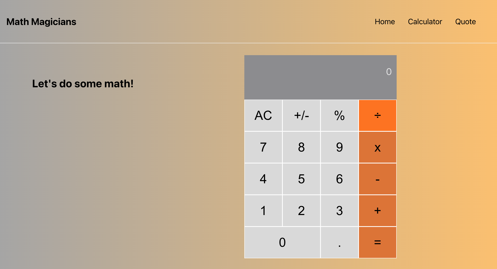

# Math Magicians

> Math magicians is a website for all fans of mathematics. It is a Single Page App (SPA) that allows users to make simple calculations and read a random math-related quote.

## Built With
- HTML & CSS & JavaScript
- Html, Css & JavaScript linters
- React.Js

## Live Demo 

[Live Demo Link using netlify](https://selmab-math-magicians.netlify.app/)\
[Live Demo Link using Heroku](https://math-magicains.herokuapp.com/)

## Getting Started

This project was bootstrapped with [Create React App](https://github.com/facebook/create-react-app).

- clone the repository by running\
    `git clone https://github.com/selma-belhadj/math-magicians.git`
- navigate to the folder\
    `cd math-magicians`
- Install packages\
    `npm install`
- Run the app\
    `npm start`
- Eject the app\
    `npm run eject`
- Create build app\
    `npm run build`
- Test Linters app\
    `npm run check-linters`

## Authors

👤 **Selma Belhadj**

- GitHub: [@selma-belhadj](https://github.com/selma-belhadj)
- Twitter: [@selma_bel_hadj](https://twitter.com/selma_bel_hadj)
- LinkedIn: [@selma-belhadj](https://www.linkedin.com/in/selma-belhadj/)

## 🤝 Contributing

Contributions, issues, and feature requests are welcome!

Feel free to check the [issues page](https://github.com/selma-belhadj/math-magicians/issues).

## Show your support

Give a ⭐️ if you like this project!

## 📝  License
This project is [MIT](./MIT.md) licensed.
